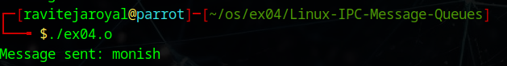

# Linux-IPC-Message-Queues
Linux IPC-Message Queues

# AIM:
To write a C program that receives a message from message queue and display them

# DESIGN STEPS:

### Step 1:

Navigate to any Linux environment installed on the system or installed inside a virtual environment like virtual box/vmware or online linux JSLinux (https://bellard.org/jslinux/vm.html?url=alpine-x86.cfg&mem=192) or docker.

### Step 2:

Write the C Program using Linux message queues API 

### Step 3:

Execute the C Program for the desired output. 

# PROGRAM:
#include <stdio.h>
#include <sys/ipc.h>
#include <sys/msg.h>
#include <string.h>
#include <stdlib.h>

// Message structure
struct message {
    long type;
    char text[100];
};

int main() {
    key_t key = ftok(".", 'a');

    if (key == -1) {
        perror("ftok");
        exit(1);
    }

    int msgid = msgget(key, 0666 | IPC_CREAT);

    if (msgid == -1) {
        perror("msgget");
        exit(1);
    }

    struct message msg;
    msg.type = 1;

    strcpy(msg.text, "monish");

    // Send message
    if (msgsnd(msgid, &msg, sizeof(msg.text), 0) == -1) {
        perror("msgsnd");
        exit(1);
    }

    printf("Message sent: %s\n", msg.text);

    return 0;
}

## C program that receives a message from message queue and display them

## OUTPUT

 

# RESULT:
The programs are executed successfully.
